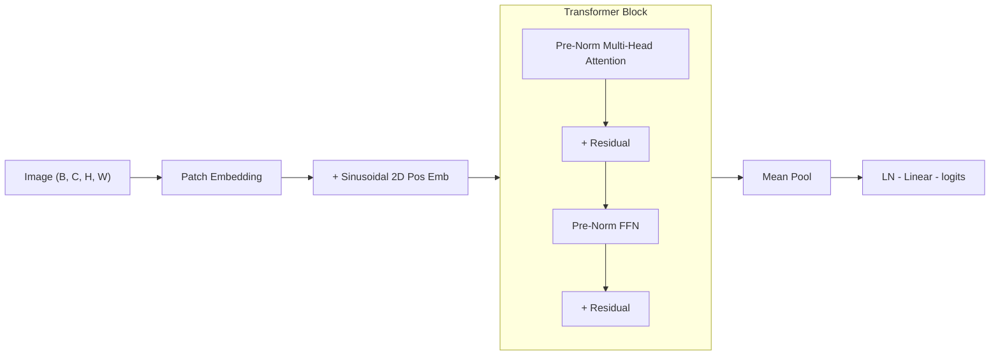
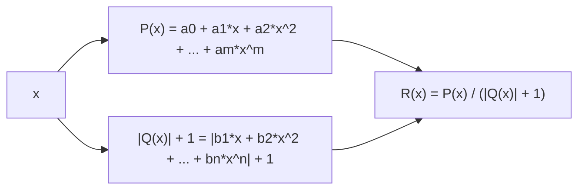
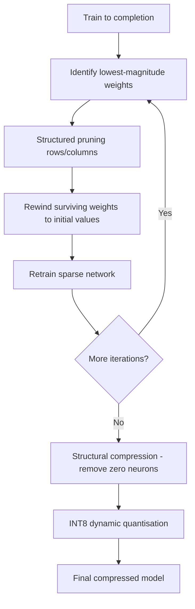

# Learnable Activations & Lottery Ticket Pruning in Vision Transformers


A Simple Vision Transformer with **learnable rational activation functions** (Padé approximants), **structured iterative pruning** via the Lottery Ticket Hypothesis, **structural compression**, and **INT8 dynamic quantisation**. Accompanying code for the bachelor thesis *"Harnessing the Power of Pruning and Learnable Activations in Transformer Networks"* (TU Darmstadt, 2023).

---

## Key Results

### Full Pipeline: Train → Prune → Compress → Quantise (CIFAR-10)

The complete pipeline compares ReLU vs learnable rational activations across all compression stages. Rational activations are initialised from a ReLU-approximating Padé fit, then learned end-to-end:

| Variant | ReLU | Rational | Delta |
|:--|:--:|:--:|:--:|
| Original (20 epochs) | 78.7% | **81.8%** | +3.1% |
| Pruned (75% FF / 50% Attn) | 80.6% | **82.4%** | +1.8% |
| Compressed (zero neurons removed) | 80.6% | **82.4%** | +1.8% |
| Quantised (INT8) | 78.6% | **81.9%** | +3.3% |
| Compressed + Quantised | 80.6% | **82.3%** | +1.7% |

> **Best model: rational compressed + quantised — 82.3% accuracy at 2.13 MB (5.7x compression from 12.13 MB)**

Both activations **improve accuracy after LTH pruning** (winning tickets found), and structural compression preserves accuracy exactly.

### Compression & Efficiency

| Metric | Original | Compressed | Compressed + Quantised |
|:--|:--:|:--:|:--:|
| Model size | 12.13 MB | 8.02 -- 8.15 MB | **2.10 -- 2.13 MB** |
| Parameters | 3.17 M | 2.09 -- 2.13 M | 2.09 -- 2.13 M |
| Compression ratio | 1x | 1.5x | **5.7x** |
| Parameter reduction | -- | 33% fewer | 33% fewer |
| Storage savings | -- | 34% | **82%** |

Structural compression physically removes zero neurons after pruning, creating genuinely smaller dense layers. Combined with INT8 quantisation, the final model is **5.7x smaller** while **improving accuracy by +1.9 percentage points** (ReLU) or **+0.5 pp** (Rational) over the unpruned baseline — a direct consequence of finding winning lottery tickets.

### Thesis Results (Full Training)

With full training schedules on additional datasets, rational activations consistently match or outperform fixed activations:

| Dataset | GELU | ReLU | SiLU | Rational |
|:--|:--:|:--:|:--:|:--:|
| SVHN | 95.07% | 95.06% | 95.08% | **95.52%** |
| CIFAR-10 | 83.10% | 79.13% | 83.37% | **83.57%** |
| Fashion-MNIST | 91.71% | 91.44% | 91.62% | **92.15%** |
| Imagenette | 79.48% | **80.33%** | 80.13% | 80.28% |

### Pruning Resilience (SVHN)

| FF Pruning | Attn Pruning | GELU | Rational |
|:--:|:--:|:--:|:--:|
| 0% | 0% | 95.07% | **95.52%** |
| 75% | 50% | 94.91% | **95.14%** |
| 96% | 50% | 94.79% | **95.19%** |
| 98% | 50% | 93.99% | **94.45%** |

> At 98% feed-forward pruning, the rational-activation model retains **94.45% accuracy** while achieving **56% inference acceleration**.

---

## Architecture



The attention mechanism uses `F.scaled_dot_product_attention`, automatically selecting Flash Attention when available.

---

## Learnable Rational Activations

Instead of a fixed activation function, each FFN block uses a **learnable rational function**:



- Coefficients are **learned end-to-end** via backpropagation
- **ReLU-initialised** — Padé coefficients are fitted to approximate ReLU, giving a strong starting point that the network can adapt during training
- Evaluated using **Horner's method** for numerical stability
- The `|Q(x)| + 1` denominator guarantees no division by zero
- A single AdamW optimizer uses **parameter groups** with separate learning rates: standard LR + weight decay for model weights, higher LR + no weight decay for activation coefficients

---

## Compression Pipeline



### Pruning (Lottery Ticket Hypothesis)

Structured pruning removes entire rows/columns, yielding dense sub-matrices that provide **actual hardware speedup** — not just theoretical sparsity.

| Layer Type | Pruning Dim | Effect |
|:--|:--:|:--|
| FF Layer 1 (`.net.1`) | Rows (dim=0) | Removes output neurons |
| FF Layer 2 (`.net.3`) | Cols (dim=1) | Matches removed FF1 outputs |
| QKV projection | Rows (dim=0) | Reduces attention dimensions |
| Output projection | Cols (dim=1) | Matches reduced attention |

### Structural Compression

After pruning, zero neurons are **physically removed** from the model, creating genuinely smaller linear layers. A neuron is only removed if it is dead in both the expansion layer (net.1 row = 0) **and** the projection layer (net.3 column = 0). This is critical for non-ReLU activations where `f(0) != 0` — rational activations with `R(0) = a₀` can route information through "dead" neurons.

### INT8 Quantisation

Dynamic INT8 quantisation via `torch.ao.quantization.quantize_dynamic` targets all `nn.Linear` layers. Supports both `fbgemm` (x86/NVIDIA) and `qnnpack` (ARM/Apple Silicon) backends, selected automatically.

---

## Quick Start

### Install

```bash
python -m venv .venv
source .venv/bin/activate
pip install -r requirements.txt
```

### Verify

```bash
python verify.py
```

Runs forward/backward passes with both GELU and rational activations on the best available device (CPU, MPS, or CUDA).

### Run Full Experiment

```bash
python run_experiment.py
```

Trains both ReLU and rational models, prunes, compresses, and quantises. Results are saved incrementally to `experiments/results.json`.

### Launch Dashboard

```bash
streamlit run dashboard.py
```

Interactive Streamlit + Plotly dashboard for visualising training curves, pruning results, compression ratios, and accuracy comparisons.

### Train Standalone

```bash
# Baseline with GELU
python train_example.py --activation gelu --epochs 20

# Learnable rational activations
python train_example.py --activation rational --epochs 20 --activation-lr 1e-3

# Quick smoke test
python train_example.py --fast-dev-run
```

---

## System Support

The codebase runs on both **remote Linux + NVIDIA GPU** servers and **local macOS + Apple Silicon** setups:

| Feature | Linux + CUDA | macOS + MPS |
|:--|:--:|:--:|
| Training | CUDA | MPS |
| Pruning | CPU (device-safe) | CPU (device-safe) |
| Compression | CPU | CPU |
| Quantisation (INT8) | fbgemm | qnnpack |
| CUDA kernel (optional) | hulk_boost | N/A (pure PyTorch fallback) |

Accelerator detection is automatic via `torch.cuda.is_available()` / `torch.backends.mps.is_available()`. Pruning is performed on CPU to avoid device conflicts in PyTorch's pruning internals, with Lightning handling accelerator transfers for training.

---

## Project Structure

```
.
├── src/
│   ├── __init__.py        # Public API exports
│   ├── model.py           # SimpleViT (Lightning module)
│   ├── activations.py     # Rational activation (PyTorch + CUDA)
│   ├── config.py          # ViTConfig dataclass + presets
│   ├── quantisation.py    # INT8 dynamic quantisation utilities
│   ├── schedulers.py      # Warmup + cosine/step LR schedulers
│   └── data.py            # CIFAR-10 / Imagenette loaders
├── pruning/
│   ├── lottery_ticket.py  # Iterative structured pruning (LTH)
│   └── compress.py        # Structural compression (remove zero neurons)
├── cuda/
│   ├── hulk_boost_*       # CUDA kernel (Horner's method)
│   └── eras_*             # Enhanced rational activation kernel
├── tests/
│   ├── test_activations.py
│   ├── test_model.py
│   └── test_pruning.py
├── run_experiment.py      # Full pipeline: train → prune → compress → quantise
├── dashboard.py           # Streamlit + Plotly results dashboard
├── verify.py              # Installation verification
├── train_example.py       # Training CLI
├── thesis.pdf             # Full bachelor thesis
└── pyproject.toml         # Project metadata
```

---

## CUDA Extension

For GPU training at scale, a custom CUDA kernel evaluates rational activations using Horner's method with shared memory:

```bash
cd cuda
python hulk_boost_setup.py install
```

The pure-PyTorch implementation works everywhere. The CUDA kernel is optional and accelerates training on NVIDIA GPUs.

---

## Citation

```bibtex
@thesis{tichy2023learnable,
  title   = {Harnessing the Power of Pruning and Learnable Activations in Transformer Networks},
  author  = {Tichy, Matthias},
  year    = {2023},
  school  = {Technical University of Darmstadt},
  type    = {Bachelor's Thesis}
}
```

## License

MIT — see [LICENSE](LICENSE).
