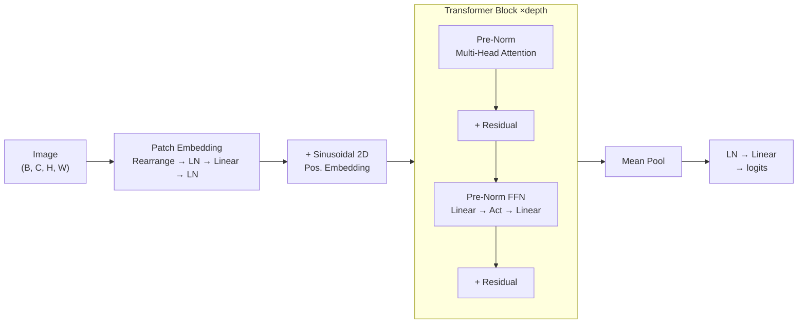
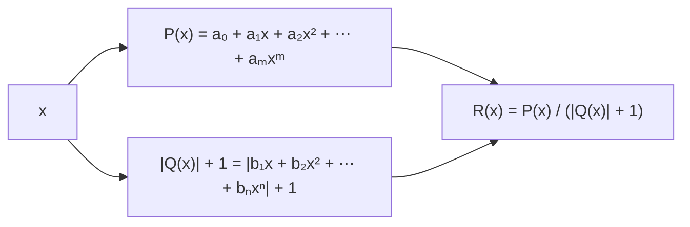
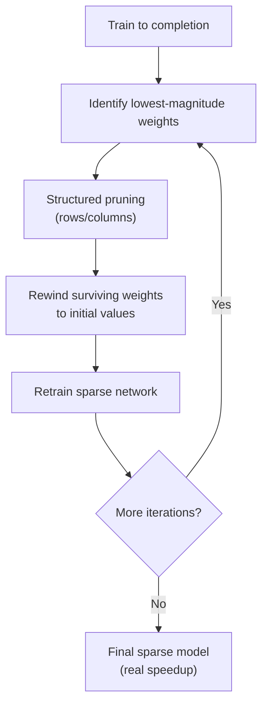

# Learnable Activations & Lottery Ticket Pruning in Vision Transformers


A Simple Vision Transformer with **learnable rational activation functions** (Padé approximants) and **structured iterative pruning** via the Lottery Ticket Hypothesis. Accompanying code for the bachelor thesis *"Harnessing the Power of Pruning and Learnable Activations in Transformer Networks"* (TU Darmstadt, 2023).

---

## Key Results

Rational activations consistently match or outperform fixed activations, and the pruned models retain accuracy even at extreme sparsity:

| Dataset | GELU | ReLU | SiLU | Rational |
|:--|:--:|:--:|:--:|:--:|
| SVHN | 95.07% | 95.06% | 95.08% | **95.52%** |
| CIFAR-10 | 83.10% | 79.13% | 83.37% | **83.57%** |
| Fashion-MNIST | 91.71% | 91.44% | 91.62% | **92.15%** |
| Imagenette | 79.48% | **80.33%** | 80.13% | 80.28% |

### Pruning Resilience (SVHN)

| FF Pruning | Attn Pruning | GELU | Rational |
|:--:|:--:|:--:|:--:|
| 0% | 0% | 95.07% | **95.52%** |
| 75% | 50% | 94.91% | **95.14%** |
| 96% | 50% | 94.79% | **95.19%** |
| 98% | 50% | 93.99% | **94.45%** |

> At 98% feed-forward pruning, the rational-activation model retains **94.45% accuracy** while achieving **56% inference acceleration**.

---

## Architecture



The attention mechanism uses `F.scaled_dot_product_attention`, automatically selecting Flash Attention when available.

---

## Learnable Rational Activations

Instead of a fixed activation function, each FFN block uses a **learnable rational function**:



- Coefficients are **learned end-to-end** via backpropagation
- Evaluated using **Horner's method** for numerical stability
- The `|Q(x)| + 1` denominator guarantees no division by zero
- A single AdamW optimizer uses **parameter groups** with separate learning rates: standard LR + weight decay for model weights, higher LR + no weight decay for activation coefficients

---

## Pruning Pipeline



Structured pruning removes entire rows/columns, yielding dense sub-matrices that provide **actual hardware speedup** — not just theoretical sparsity.

| Layer Type | Pruning Dim | Effect |
|:--|:--:|:--|
| FF Layer 1 (`.net.1`) | Rows (dim=0) | Removes output neurons |
| FF Layer 2 (`.net.3`) | Cols (dim=1) | Matches removed FF1 outputs |
| QKV projection | Rows (dim=0) | Reduces attention dimensions |
| Output projection | Cols (dim=1) | Matches reduced attention |

---

## Quick Start

### Install

```bash
python -m venv .venv
source .venv/bin/activate
pip install -r requirements.txt
```

### Verify

```bash
python verify.py
```

Runs forward/backward passes with both GELU and rational activations on the best available device (CPU, MPS, or CUDA).

### Train

```bash
# Baseline with GELU
python train_example.py --activation gelu --epochs 20

# Learnable rational activations
python train_example.py --activation rational --epochs 20 --activation-lr 1e-3

# Quick smoke test
python train_example.py --fast-dev-run
```

---

## Project Structure

```
.
├── src/
│   ├── __init__.py        # Public API exports
│   ├── model.py           # SimpleViT (Lightning module)
│   ├── activations.py     # Rational activation (PyTorch + CUDA)
│   ├── config.py          # ViTConfig dataclass + presets
│   ├── schedulers.py      # Warmup + cosine/step LR schedulers
│   └── data.py            # CIFAR-10 / Imagenette loaders
├── pruning/
│   └── lottery_ticket.py  # Iterative structured pruning (LTH)
├── cuda/
│   ├── hulk_boost_*       # CUDA kernel (Horner's method)
│   └── eras_*             # Enhanced rational activation kernel
├── tests/
│   ├── test_activations.py
│   ├── test_model.py
│   └── test_pruning.py
├── verify.py              # Installation verification
├── train_example.py       # Training CLI
├── thesis.pdf             # Full bachelor thesis
└── pyproject.toml         # Project metadata
```

---

## CUDA Extension

For GPU training at scale, a custom CUDA kernel evaluates rational activations using Horner's method with shared memory:

```bash
cd cuda
python hulk_boost_setup.py install
```

The pure-PyTorch implementation works everywhere. The CUDA kernel is optional and accelerates training on NVIDIA GPUs.

---

## Citation

```bibtex
@thesis{tichy2023learnable,
  title   = {Harnessing the Power of Pruning and Learnable Activations in Transformer Networks},
  author  = {Tichy, Matthias},
  year    = {2023},
  school  = {Technical University of Darmstadt},
  type    = {Bachelor's Thesis}
}
```

## License

MIT — see [LICENSE](LICENSE).
